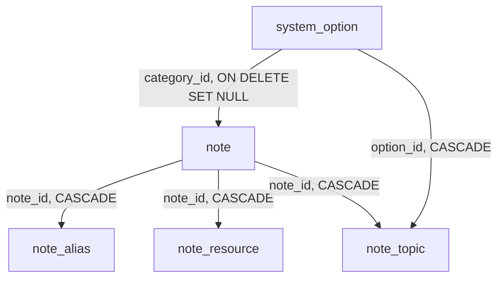

# Data model

Every table, what it holds, and the constraints that hold it. The vocabularies
the tables draw on are listed in [options.md](options.md); the endpoints that
read and write them in [api.md](api.md).

Models are in `app/models/`; the schema is built by Alembic
(`alembic/versions/`), and `tests/test_migrations_build_the_schema.py` proves
the chain builds from zero and matches the models.

## Tables

- [`system_option`](#system_option) — one value of an open vocabulary
- [`note`](#note) — a piece of knowledge: a term, a tip, advice, a note
- [`note_alias`](#note_alias) — names a note can be searched by
- [`note_resource`](#note_resource) — the links kept with a note
- [`note_topic`](#note_topic) — a note's topic tags

**What a note owns cascades with it; what it names gives way.** Aliases,
resources and topic links go when the note goes. Deleting an option sets
`note.category_id` NULL and removes the topic links naming it — a note is worth
keeping without them.

Every table carries `created_at` and `updated_at` except the link and child
tables; both are `timestamptz` defaulted by the database clock
(`TimestampMixin`, `app/models/base.py`).

## `system_option`

| Column | Type | Null | Default | Notes |
| --- | --- | --- | --- | --- |
| `id` | integer | no | | |
| `category` | text | no | | A key of `OPTION_CATEGORIES` (`app/constants.py`); `ck_system_option_category` is built from the registry. |
| `value` | text | no | | What is displayed. Trimmed on the way in. |
| `description` | text | yes | | What the value means, shown on the Options page and in every picker. |
| `remark` | text | yes | | A note to yourself; the Options page only. |
| `sort_order` | integer | no | `0` | Order inside the category. A value created without one goes last. |

`uq_system_option_value` is a unique index on `(category, lower(btrim(value)))`:
`速寫` and ` 速寫 `, `Hand` and `hand`, are one value.

**Entities link to an option by id, never by copying its text**, so renaming a
value is one row and shows everywhere at once. Which category a field accepts
is checked in the service (a foreign key cannot see the category).

## `note`

| Column | Type | Null | Default | Notes |
| --- | --- | --- | --- | --- |
| `id` | integer | no | | |
| `name_cn`, `name_en`, `name_alt` | text | yes | | At least one (`ck_note_has_a_name`). **Not unique.** |
| `category_id` | integer | yes | | → `system_option`, `ON DELETE SET NULL`, indexed. A `note_category` option. |
| `summary` | text | yes | | One or two sentences; a 名詞's definition. Shown in lists and searched. |
| `body` | text | yes | | Markdown. Not searched. |
| `remark` | text | yes | | |
| `visibility` | text | no | `private` | `private`, `unlisted` or `public` (`ck_note_visibility`). Nothing reads it yet. |

`display_name` is `name_cn`, else `name_en`, else `name_alt`
(`NameFallbackMixin`).

**The category is optional**: a note is worth writing before you decide what
kind it is.

**`visibility` is reserved.** It exists so that sharing, when it is built, adds
checks rather than a column; see `CLAUDE.md`, "Who can see it".

## `note_alias`

| Column | Type | Null | Notes |
| --- | --- | --- | --- |
| `id` | integer | no | |
| `note_id` | integer | no | → `note`, `CASCADE`, indexed |
| `value` | text | no | |

Anything you might type to find a note; searched, never displayed.
`uq_note_alias` on `(note_id, value)`; `ix_note_alias_lookup` on `lower(value)`.
A save reconciles the list by value, so an unchanged alias keeps its row.

## `note_resource`

| Column | Type | Null | Notes |
| --- | --- | --- | --- |
| `id` | integer | no | |
| `note_id` | integer | no | → `note`, `CASCADE`, indexed |
| `position` | integer | no | The order sent. No unique constraint: the list is replaced whole on a save. |
| `name` | text | yes | |
| `url` | text | no | `ck_note_resource_has_a_url` (`btrim(url) <> ''`). http or https; a URL with no scheme is stored with `https://`. |

## `note_topic`

| Column | Type | Null | Notes |
| --- | --- | --- | --- |
| `note_id` | integer | no | → `note`, `CASCADE`; part of the PK |
| `option_id` | integer | no | → `system_option`, `CASCADE`; part of the PK; `ix_note_topic_option` |

`topic` options only. Returned ordered by the option's `sort_order`.
