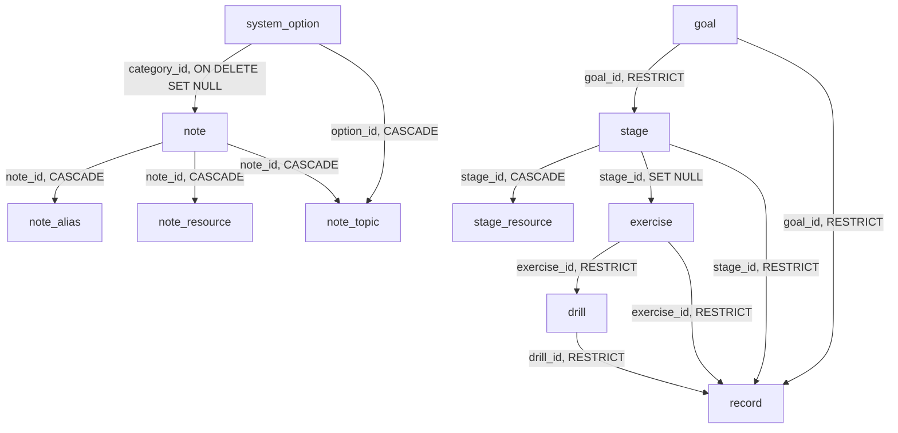

# Data model

Every table, what it holds, and the constraints that hold it. The vocabularies
the tables draw on are listed in [options.md](options.md); the endpoints that
read and write them in [api.md](api.md).

Models are in `app/models/`; the schema is built by Alembic
(`alembic/versions/`), and `tests/test_migrations_build_the_schema.py` proves
the chain builds from zero and matches the models.

## Tables

- [`exercise`](#exercise) — what is practised (練習項目)
- [`drill`](#drill) — one prescribed way of practising an exercise (練法)
- [`record`](#record) — one time something was practised
- [`active_timer`](#active_timer) — the one running timer
- [`goal`](#goal) — a level of the roadmap, L0 to L5
- [`stage`](#stage) — one stage of a level, with its test
- [`stage_resource`](#stage_resource) — the links kept with a stage
- [`system_option`](#system_option) — one value of an open vocabulary
- [`note`](#note) — a piece of knowledge: a term, a tip, advice, a note
- [`note_alias`](#note_alias) — names a note can be searched by
- [`note_resource`](#note_resource) — the links kept with a note
- [`note_topic`](#note_topic) — a note's topic tags

**What a note owns cascades with it; what it names gives way.** Aliases,
resources and topic links go when the note goes. Deleting an option sets
`note.category_id` NULL and removes the topic links naming it — a note is worth
keeping without them.

Every table carries `created_at` and `updated_at` except the link and child
tables; both are `timestamptz` defaulted by the database clock
(`TimestampMixin`, `app/models/base.py`).

## `exercise`

What is practised: gesture drawing, boxes in perspective, the head. `food`'s
dish to the drill's recipe.

| Column | Type | Null | Notes |
| --- | --- | --- | --- |
| `id` | integer | no | |
| `name_cn`, `name_en`, `name_alt` | text | yes | At least one (`ck_exercise_has_a_name`) |
| `stage_id` | integer | yes | → `stage`, `ON DELETE SET NULL`, indexed. Empty for what is practised at every level (gesture, character pieces) |
| `description` | text | yes | Searched |
| `remark` | text | yes | |

Children, each the shape of its `note_` counterpart: `exercise_alias`,
`exercise_resource` and `exercise_topic` (`topic` options only).

**An exercise with drills, or named by records, cannot be deleted**; the API
says how many of each are in the way.

## `drill`

| Column | Type | Null | Notes |
| --- | --- | --- | --- |
| `id` | integer | no | |
| `exercise_id` | integer | no | → `exercise`, `RESTRICT`, indexed |
| `name` | text | yes | `display_name` falls back to the exercise's |
| `source_id` | integer | yes | → `system_option`, `SET NULL`, indexed. A `source` option |
| `instructions` | text | yes | Markdown |
| `unit` | text | yes | 頁, 張, 組, 個 |
| `target` | integer | yes | Units in one round; ≥ 1 |
| `suggested_minutes` | integer | yes | ≥ 1 |
| `frequency` | text | yes | As the course words it: `daily for 3 weeks`, 每天 |
| `remark` | text | yes | |
| `position` | integer | no | Order inside its exercise |

Children: `drill_source_link` (the course lectures) and `drill_resource`, both
the `note_resource` shape.

## `record`

One time one exercise was practised. **The record is the spine**: nothing
here demands a timer, a drill or a stage before a record can be written.

| Column | Type | Null | Default | Notes |
| --- | --- | --- | --- | --- |
| `id` | integer | no | | |
| `date` | date | no | | Indexed |
| `location_id` | integer | yes | | → option, `SET NULL`. A `location` option |
| `duration_minutes` | integer | yes | | ≥ 0. Empty when nobody timed it |
| `drill_id` | integer | yes | | → `drill`, `RESTRICT`, indexed |
| `exercise_id` | integer | yes | | → `exercise`, `RESTRICT`, indexed |
| `kind` | text | no | `practice` | `practice`, `piece`, `test` (`ck_record_kind`) |
| `stage_id` | integer | yes | | → `stage`, `RESTRICT`, indexed. The stage whose test this is |
| `goal_id` | integer | yes | | → `goal`, `RESTRICT`, indexed. The level whose test this is |
| `method_id`, `tool_id` | integer | yes | | → option, `SET NULL`, indexed |
| `notes` | text | yes | | |

- **`ck_record_one_activity`**: a drill, an exercise, or neither — never both.
  Through a drill, the exercise is derived.
- **`ck_record_test_target`**: a `test` record names exactly one of a stage and
  a goal; any other kind names neither.
- **Records restrict what they name.** A record is history: deleting the drill,
  exercise, stage or goal it names is refused with the count.

Child: `record_reference`, the `note_resource` shape — the references drawn
from.

## `active_timer`

The running timer. **At most one row** (`uq_active_timer_single`, a unique
index on `((true))`), and none when nothing is being timed.

| Column | Type | Null | Notes |
| --- | --- | --- | --- |
| `id` | integer | no | |
| `mode` | text | no | `stopwatch` or `countdown` (`ck_active_timer_mode`) |
| `target_seconds` | integer | yes | Set for a countdown, empty for a stopwatch (`ck_active_timer_target`); ≥ 1 |
| `started_at` | timestamptz | no | When it was first started; database clock |
| `running_since` | timestamptz | yes | Set only while running |
| `elapsed_seconds` | integer | no | Counted before `running_since`; ≥ 0 |
| `stopped_at` | timestamptz | yes | Set by stop; a stopped timer waits for its record |
| `drill_id`, `exercise_id` | integer | yes | → `drill` / `exercise`, `SET NULL`; never both (`ck_active_timer_one_activity`) |

- **State is derived**: running (`running_since` set), paused (neither),
  stopped (`stopped_at` set); `ck_active_timer_state` forbids both.
- **Every time is the database's clock**, never a browser's: two devices look
  at one timer.
- `SET NULL`, not `RESTRICT`, on the activity: a running timer is not history.

## `goal`

A level: what you can draw at the end of it, and the test that shows it.

| Column | Type | Null | Default | Notes |
| --- | --- | --- | --- | --- |
| `id` | integer | no | | |
| `code` | text | no | | `L0` … `L5`; unique as written (`uq_goal_code`), trimmed |
| `name_cn`, `name_en`, `name_alt` | text | yes | | At least one (`ck_goal_has_a_name`) |
| `position` | integer | no | | Order on the roadmap. Created without one, it goes last |
| `description` | text | yes | | Done when you can … |
| `test` | text | yes | | The test piece |
| `status` | text | no | `planned` | `planned`, `active`, `achieved` (`ck_goal_status`) |
| `achieved_on` | date | yes | | Only with `achieved` (`ck_goal_achieved_on_iff_achieved`); achieved may leave it empty |
| `remark` | text | yes | | |

**Status is set by hand.** Nothing derives it from the stages: a level is
passed on its test, which may come before every stage is ticked.

**A goal with stages cannot be deleted** (`stage.goal_id` is `RESTRICT`); the
API says how many stages are in the way.

## `stage`

| Column | Type | Null | Default | Notes |
| --- | --- | --- | --- | --- |
| `id` | integer | no | | |
| `goal_id` | integer | no | | → `goal`, `RESTRICT`, indexed |
| `position` | integer | no | | Order inside its goal; last when not given |
| `name_cn`, `name_en`, `name_alt` | text | yes | | At least one (`ck_stage_has_a_name`) |
| `description` | text | yes | | What is practised |
| `test` | text | yes | | The stage's test |
| `status` | text | no | `not_started` | `not_started`, `in_progress`, `passed` (`ck_stage_status`) |
| `passed_on` | date | yes | | Only with `passed`, as `achieved_on` |
| `remark` | text | yes | | |

**The stage number is derived, never stored**: every stage ordered by goal
position, goal id, stage position, stage id, numbered from 0. Moving a stage
renumbers everything after it.

## `stage_resource`

The `note_resource` shape: `id`, `stage_id` (`CASCADE`), `position`, `name`,
`url` (`ck_stage_resource_has_a_url`). The lectures worth rewatching when the
stage starts.

## The roadmap seed

Migration `0003_goals_and_roadmap` writes the roadmap agreed with the owner:
six goals (L0 基礎, L1 人體, L2 角色, L3 場景, L4 上色, L5 插畫) and sixteen
stages numbered 0 to 15, with their descriptions and tests; L0 `active`,
everything else not started. It is the seed, not the truth — the roadmap pages
edit it — and it is idempotent, keyed on the goal code and on goal plus
`name_cn` for a stage.

## `system_option`

| Column | Type | Null | Default | Notes |
| --- | --- | --- | --- | --- |
| `id` | integer | no | | |
| `category` | text | no | | A key of `OPTION_CATEGORIES` (`app/constants.py`); `ck_system_option_category` is built from the registry. |
| `value` | text | no | | What is displayed. Trimmed on the way in. |
| `description` | text | yes | | What the value means, shown on the Options page and in every picker. |
| `remark` | text | yes | | A note to yourself; the Options page only. |
| `sort_order` | integer | no | `0` | Order inside the category. A value created without one goes last. |

`uq_system_option_value` is a unique index on `(category, lower(btrim(value)))`:
`速寫` and ` 速寫 `, `Hand` and `hand`, are one value.

**Entities link to an option by id, never by copying its text**, so renaming a
value is one row and shows everywhere at once. Which category a field accepts
is checked in the service (a foreign key cannot see the category).

## `note`

| Column | Type | Null | Default | Notes |
| --- | --- | --- | --- | --- |
| `id` | integer | no | | |
| `name_cn`, `name_en`, `name_alt` | text | yes | | At least one (`ck_note_has_a_name`). **Not unique.** |
| `category_id` | integer | yes | | → `system_option`, `ON DELETE SET NULL`, indexed. A `note_category` option. |
| `summary` | text | yes | | One or two sentences; a 名詞's definition. Shown in lists and searched. |
| `body` | text | yes | | Markdown. Not searched. |
| `remark` | text | yes | | |
| `visibility` | text | no | `private` | `private`, `unlisted` or `public` (`ck_note_visibility`). Nothing reads it yet. |

`display_name` is `name_cn`, else `name_en`, else `name_alt`
(`NameFallbackMixin`).

**The category is optional**: a note is worth writing before you decide what
kind it is.

**`visibility` is reserved.** It exists so that sharing, when it is built, adds
checks rather than a column; see `CLAUDE.md`, "Who can see it".

## `note_alias`

| Column | Type | Null | Notes |
| --- | --- | --- | --- |
| `id` | integer | no | |
| `note_id` | integer | no | → `note`, `CASCADE`, indexed |
| `value` | text | no | |

Anything you might type to find a note; searched, never displayed.
`uq_note_alias` on `(note_id, value)`; `ix_note_alias_lookup` on `lower(value)`.
A save reconciles the list by value, so an unchanged alias keeps its row.

## `note_resource`

| Column | Type | Null | Notes |
| --- | --- | --- | --- |
| `id` | integer | no | |
| `note_id` | integer | no | → `note`, `CASCADE`, indexed |
| `position` | integer | no | The order sent. No unique constraint: the list is replaced whole on a save. |
| `name` | text | yes | |
| `url` | text | no | `ck_note_resource_has_a_url` (`btrim(url) <> ''`). http or https; a URL with no scheme is stored with `https://`. |

## `note_topic`

| Column | Type | Null | Notes |
| --- | --- | --- | --- |
| `note_id` | integer | no | → `note`, `CASCADE`; part of the PK |
| `option_id` | integer | no | → `system_option`, `CASCADE`; part of the PK; `ix_note_topic_option` |

`topic` options only. Returned ordered by the option's `sort_order`.

## The exercise seed

Migration `0004_exercises_and_records` writes 24 exercises and 57 drills from
the owner's own notes (細節指示) and the assignment list of the three Udemy
courses they finished: each drill's source, suggested minutes and frequency as
the course gives them, a range taking its lower bound in `suggested_minutes`.
Exercises find their stage by goal code and the stage's seeded name; one the
owner has renamed leaves the exercise without a stage rather than failing.
It also adds the `source`, `location` and `tool` options. Idempotent; the seed,
not the truth.
